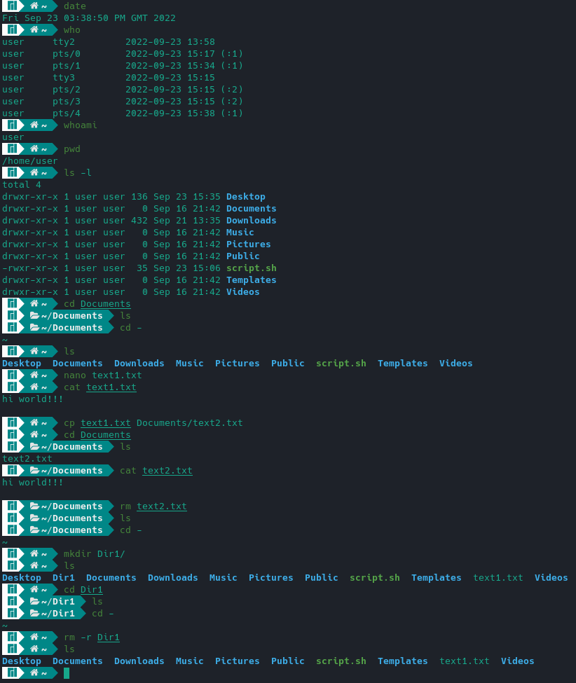
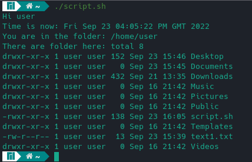

# Отчет по лабораторной работе №2 по курсу "Фундаментальная информатика"
___Студент группы___ М8О-108Б-22 
___ФИО___ Сибирцев Роман Денисович 
___Почта___ sibirtsevr1@gmail.com
___Преподаватель___ Сахарин Никита Александрович

### 1. Тема
__Операционная среда ОС UNIX__

### 2. Цель работы
__Изучение и освоение программного обеспечения ОС UNIX и приобретение навыков, необходимых для выполнения курсовых и лабораторных работ в среде UNIX__

### 3. Задание
__Изучение и освоение программного обеспечения ОС UNIX и приобретение навыков, необходимых для выполнения курсовых и лабораторных работ в среде UNIX__

### 4. Оборудование
___Прицессор___: AMD Ryzen 5 3600 (12) @ 3.600GHz 
___ОП___: 15944MiB
___НМД___: 1TB

### 5. Программное обеспечение
___Операционная система семейства___ UNIX, ___наименование___ Manjaro Linux, ___версия___  5.15.65-1-MANJARO
___Интерпритатор команд___ bash, ___версия___ 5.1.16
___Редактор текстов___ nano

### 6. Идея, метод, алгоритм решения
__Для достижения поставленной цели используем основные команды bash для работы с каталогами, текстовыми файлами, тектовыми редакторами и некоторыми утилитами.__

### 7. Сценарий выполнения работы
#### Используемые команды

    date
_выводит текущее время_

    who
_выводит информацию о пользователях, которые подключены к системе, в том числе и об терминальных сессиях, через которые происходит подключение_

    pwd 

_выводит полный путь текущего рабочего каталога_

    ls 
_выводит содержимое каталогов и информацию о файлах_

    cd
_используется для изменения текущего рабочего каталога_

    cp
_используется для копирования файлов и каталогов_

    mv
_применяется для перемещения и переименования файлов и каталогов_
    
    mkdir
_используемая для создания каталога_

    rmdir
_используется для удаления каталогов из файловой системы. Можно заменить на команду rm с флагом -r_

    rm
_используется для удаления файлов и целых деревьев каталогов_

    man
_используется для просмотра справочных руководств системы_

    cat
_используется для отображения текстовых файлов, копирования текстовых файлов в новый документ, присоединения содержимого текстового файла в конце другого текстового файла для их объединения._

    nano
_текстовый редактор_

##### Скрипт для создания протокола
```
#!/bin/bash
echo "Hi $(whoami)"
echo "Time is now: $(date)"
echo "You are in the folder: $(pwd)"
echo  "There are folder here: $(ls -l)"
```


### 8. Распечатка протокола



___Запуск скрипта:___



### 9. Выводы

Я ознакомился с основными командами ОС UNIX, научился перемещаться по директориям, создавать, редактировать, читать, удалять файлы. Получил базовые навыки владения ОС UNIX.


