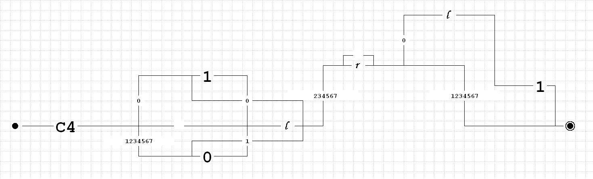
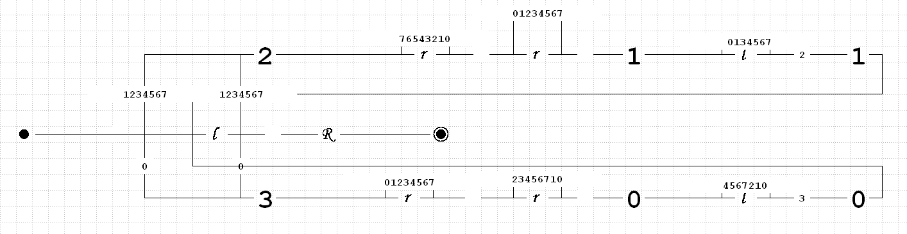

# Отчёт по лабораторной работе №6 по курсу “Фундаментальная информатика”

<b>Студент группы:</b> <ins>М80-108Б-22 Халимов Исмоилджон Ибрагимджонович, № по списку 22</ins> 

<b>Контакты e-mail:</b> <ins>lirikfeed049@gmail.com</ins>

<b>Работа выполнена:</b> «15» <ins>октября</ins> <ins>2022</ins> г.

<b>Преподаватель:</b> <ins>асп. каф. 806 Сахарин Никита Александрович</ins>

<b>Входной контроль знаний с оценкой:</b> <ins></ins>

<b>Отчет сдан</b> «24» <ins>сентября</ins> <ins>2022</ins> г., <b>итоговая оценка</b> <ins></ins>

<b>Вариант  31 </b>

<b>Подпись преподавателя:</b> ________________

### 1. Тема работы:
__Конструирование диаграмм Тьюринга__

### 2. Цель работы:
__Научиться разрабатывать диаграммы Тьюринга__

### 3. Задание:
__Получение обратной кодировки двоичного отрицательного числа с тем же абсолютным значением__

### 4. Оборудование:
___Процессор___: AMD Ryzen 5 3500U (8) @ 2.10GHz \
___ОП___: 6940MiB \
___SSD___: 256 GB

### 5. Программное обеспечение:
___Операционная система семейства___ UNIX, ___наименование___ Manjaro Linux, ___версия___  5.15.65-1-MANJARO
___Интерпритатор команд___ bash, ___версия___ 5.1.16
___Редактор текстов___ nano

### 6. Идея, метод, алгоритм решения:
__Для выполнения задания я использую команды из справочника по работе с диаграммами Тьюринга__

### 7. Сценарий выполнения работы:
#### Разработать диаграмму Тьюринга решения задачи в среде интерпретатора VTM или jdt (или VisualTuring 2.0!) с использованием стандартных машин (r, l, R, L, Kn, i a) и вспомогательных машин, определяемых поставленной задачей.

### 8.Диаграммы для решения задачи:

### 9.Вывод работы:

__Изучив комнады для работы на машине Тьюринга я смог выполнить посталенную передо мной задачу__
