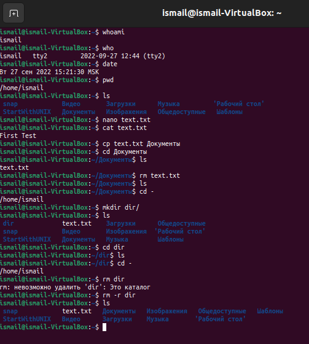

# Лабораторная работа №2 по курсу "Фундаментальная информатика"
___ФИО:___ Халимов Исмоилджон Ибрагимджонович \
___Группа:___ М8О-108Б-22 \
___Преподаватель:___ Сахарин Никита Александрович

### 1. Тема работы:
__Операционная среда ОС UNIX__

### 2. Цель работы:
__Анализ и освоение Программного Обеспечения ОС UNIX. Обучение навыкам, необходимым для выполнения лабораторных работ в среде UNIX__

### 3. Задание:
__Запомнить основные функции команд в терминале ОС UNIX и опробовать их на практике__

### 4. Оборудование:
___Прицессор___: AMD Ryzen 5 3500U (8) @ 2.10GHz \
___ОП___: 6940MiB \
___SSD___: 256 GB

### 5. Программное обеспечение:
___Операционная система семейства___ UNIX, ___наименование___ Manjaro Linux, ___версия___  5.15.65-1-MANJARO
___Интерпритатор команд___ bash, ___версия___ 5.1.16
___Редактор текстов___ nano

### 6. Идея, метод, алгоритм решения:
__Для достижения поставленной цели используем основные команды bash для работы с каталогами, текстовыми файлами, тектовыми редакторами и некоторыми утилитами.__

### 7. Сценарий выполнения работы:
#### Используемые команды для:

    whoami
_просмотра действительного идентификатора пользователя (UID)_

    who
_вывода информации о пользователях, которые подключены к системе, в том числе и о терминальных сессиях, через которые происходит подключение_

    date
_вывода текущего времени_

    pwd 
_вывода полного пути от корневого каталога к текущему рабочему каталогу_

    ls 
_просмотра текущего каталога и содержимого в папке_

    cd
_смены текущего каталога_

    cp
_копирования файлов и каталогов_

    mv
_перемещения и переименования файлов и каталогов_
    
    mkdir
_создания каталога_

    rmdir
_удаления каталогов из файловой системы_

    rm
_удаления папок и файлов_

    man
_просмотра справочных руководств системы_

    cat
_просмотра содержимого в файле_

##### Скрипт для создания протокола
```
#!/bin/bash
echo "Hi $(whoami)"
echo "Time is now: $(date)"
echo "You are in the folder: $(pwd)"
echo  "There are folder here: $(ls -l)"
```

### 8.Пример работы команд:



#### Запуск скрипта:


### 9.Вывод работы:

__Я вводил команды ОС UNIX попутно изучая подробности их функций. Получил базовые знания работы с терминалом. Также ввёл команды в скрипт и запустил его.__


